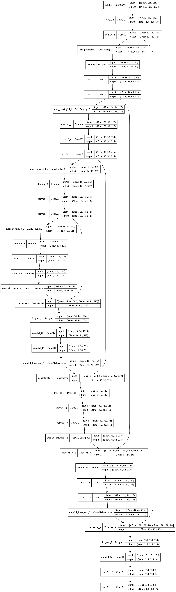

# Introduction
U-Net is a semantic segmentation technique originally proposed for medical imaging segmentation. It’s one of the earlier deep learning segmentation models, and the U-Net architecture is also used in many GAN variants such as the Pix2Pix generator.

# Tutorial
In order to run the training process, please route to our folder and use ```python main.py```. At the end of the training process, there will be predictions or not depend on your configs in [config file](./configs.py). Model infrastructure is included in [this file](./model.py).\
The whole visualizing and iteracting is implemented in [google colab notebook](./unet_pet_segmentation.ipynb).



# Credit
Link: https://pyimagesearch.com/2022/02/21/u-net-image-segmentation-in-keras/#:~:text=U%2DNet%20is%20a%20semantic,such%20as%20the%20Pix2Pix%20generator.
